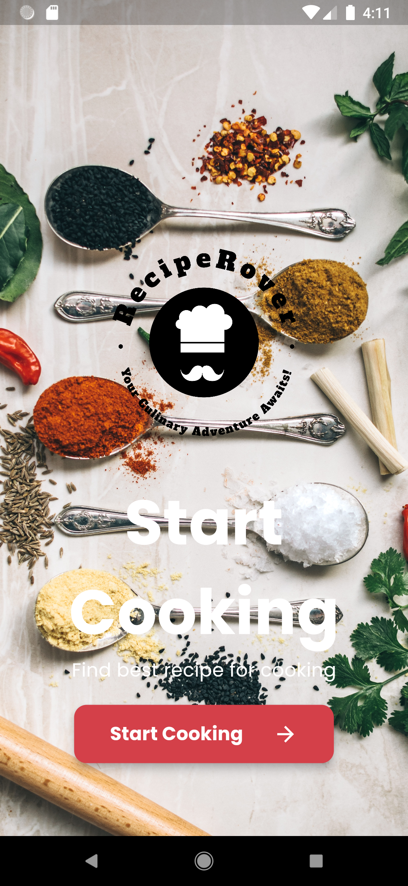
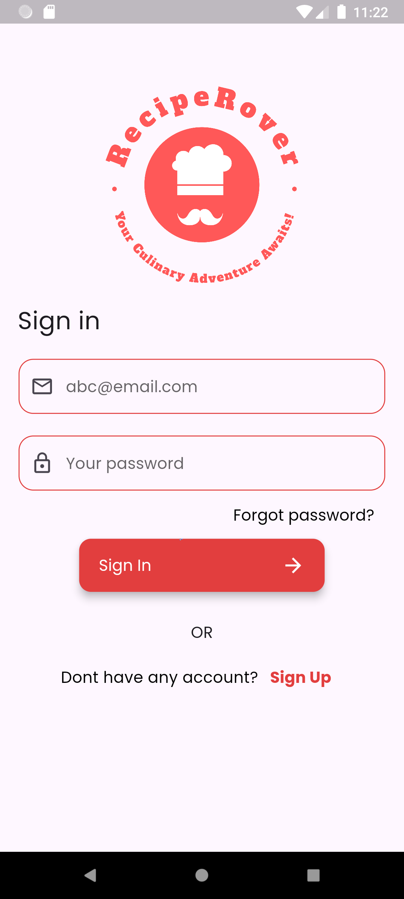
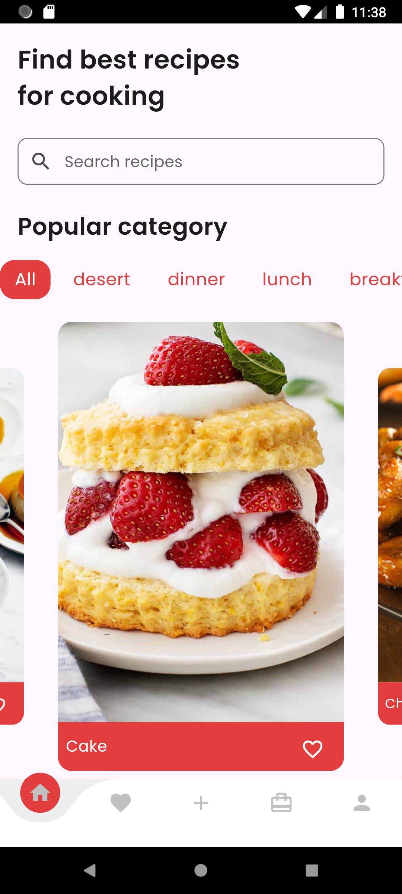
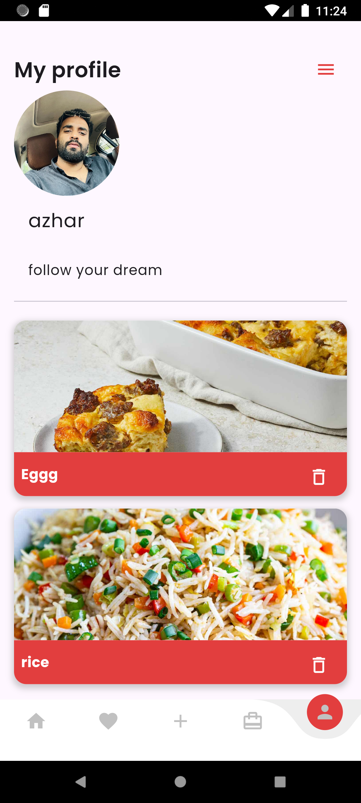

# RecipeRover 🍴📱

## App Screenshot 📸

  
  
  
  

**Recipe Rover** is a mobile application designed to help users manage their recipes, organize inventory, and explore culinary delights. With an intuitive interface and powerful features, Recipe Rover is your ultimate recipe management companion.

---

## Features ✨

- **Recipe Management**: Add, save, and organize recipes effortlessly.
- **Ingredient Search**: Find recipes based on available ingredients and taste preferences.
- **Shopping List**: Create a shopping list of required ingredients.
- **Private Recipes**: Securely store and manage your private recipes.
- **Favorites**: Save your most loved recipes for quick access.
- **Firebase & Hive Integration**: Securely store and sync your data across devices.
- **User-Friendly Interface**: Navigate the app with ease and enjoy a seamless experience.

---

## Technologies Used 🛠️

- **Framework**: Flutter
- **Database**: Firebase, Hive

